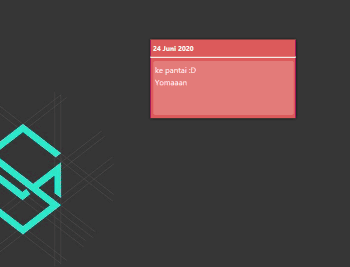

# NotesFx
 Simple notes build in JavaFx

## Download app
  - [NotesFx v1.3.0.zip](https://github.com/rizalmf/NotesFx/raw/master/out/NotesFx%20v1.3.0.zip) (JRE 8 and JavaFx 8 SDK needed).
  - [NotesFx v1.3.0-Installer.exe](https://github.com/rizalmf/NotesFx/raw/master/out/NotesFx%20v1.3.0-installer.exe) (Windows only).
  - [Older version..](https://github.com/rizalmf/NotesFx/tree/master/out) 

### Screenshot

### Changelog
- **v1.3.0 (build ready)**
   - add save resized notes, fix textarea binding
- **v1.2.1 (build ready)**
   - fix resizeable notes, remove unused vars
- v1.2.0
   - add feature resizeable notes, optimize fxml, change default background, takeout unused library
- v1.1.2
   - fix bug start notes, change new note color, fix wording
- v1.1.1
   - change database structure, change main class, optimize fxml unit
- **v1.0.0 (build ready)**
   - first commit
